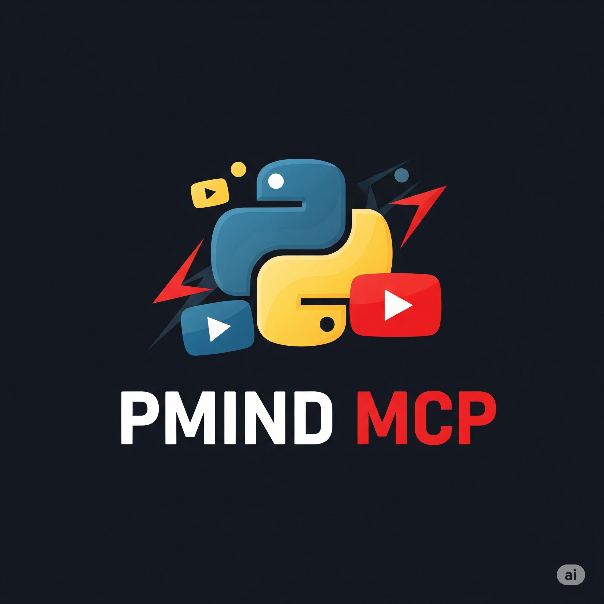

<div align="center">
  
</div>

> ⚠️ **Alpha Software**: This MCP server is in early alpha stage and may have rough edges. Please report any issues you encounter.

# PMIND YouTube MCP Server

A Python implementation of the YouTube MCP (Model Context Protocol) server using FastMCP. This server provides tools to interact with YouTube Data API v3 and fetch video transcripts.

## 🎯 Features

This MCP server provides comprehensive access to YouTube Data API v3 with additional AI-powered capabilities through Gemini integration.

### 📦 Core Capabilities

- **🎬 Video Management**: List, rate, update, delete videos, and manage uploads
- **🔍 Search**: Full YouTube search with advanced filters
- **📺 Channel Operations**: Manage channel content, banners, and sections
- **📋 Playlists**: Create and manage playlists and their items
- **🔔 Subscriptions**: Manage channel subscriptions
- **💬 Comments**: Read and write comments with moderation
- **📝 Captions**: Access and manage video captions
- **🎨 Media**: Upload thumbnails and manage watermarks
- **📊 Metadata**: Access categories, regions, and languages
- **🤖 AI Analysis**: Analyze videos with Gemini AI

### ✨ Key Features

- **🔐 OAuth Authentication**: Full YouTube API access with secure authentication
- **🚀 Background Video Uploads**: Video uploads spawn separate processes for non-blocking operation. Upload progress is tracked persistently, enabling you to start uploads and monitor them asynchronously
- **📡 Comprehensive YouTube API Coverage**: Complete implementation of YouTube Data API v3 - videos, channels, playlists, comments, captions, subscriptions, and more
- **🧠 AI-Powered Video Analysis**: Gemini integration for video content analysis, Q&A, and transcript generation
- **📄 Raw Transcript Support**: Extract existing YouTube transcripts via youtube-transcript-api without API quota usage

## Installation & Setup

### Step 1: Clone the Repository

```bash
git clone https://github.com/raveenplgithub/pmind-mcp-youtube.git
cd pmind-youtube-mcp
```

### Step 2: Install Dependencies

```bash
# Install dependencies using Poetry
poetry install
```

### Step 3: Set Up Google OAuth Credentials

#### Access Google Cloud Console
- Go to [https://console.cloud.google.com/](https://console.cloud.google.com/)
- Sign in with your Google account

#### Create or Select Project
- Click the project dropdown at the top
- Either select existing or click "NEW PROJECT"
- Enter project name (e.g., "YouTube MCP Server")
- Click "CREATE"

#### Enable YouTube Data API v3
- In left sidebar: **APIs & Services** → **Library**
- Search for "YouTube Data API v3"
- Click on it and press **ENABLE**

#### Configure OAuth Consent Screen (First time only)
- Go to **APIs & Services** → **OAuth consent screen**
- Choose **External** and click **CREATE**
- Fill required fields:
  - App name: "YouTube MCP Server"
  - User support email: Your email
  - Developer contact: Your email
- Click **SAVE AND CONTINUE**
- On Scopes page, click **ADD OR REMOVE SCOPES**
- Select these scopes:
  - `https://www.googleapis.com/auth/youtube`
  - `https://www.googleapis.com/auth/youtube.force-ssl`
- Click **UPDATE** → **SAVE AND CONTINUE**
- **IMPORTANT for Testing**: On the Test users page, click **+ ADD USERS**
  - Add your Google account email address
  - Add any other email addresses that will use the app during testing
  - Click **ADD** → **SAVE AND CONTINUE**
- Review the summary and click **BACK TO DASHBOARD**

**Note**: Keep your app in **Testing** mode for personal use - no verification needed. Just add your email as a test user.

#### Create OAuth 2.0 Credentials
- Go to **APIs & Services** → **Credentials**
- Click **+ CREATE CREDENTIALS** → **OAuth client ID**
- Select **Desktop app** as Application type
- Name it (e.g., "YouTube MCP Desktop Client")
- Click **CREATE**

#### Download Credentials
- Click **DOWNLOAD JSON** button in the popup
- Save the file for use in Step 5

### Step 4: Configure the Server

Run the configuration wizard:

```bash
poetry run pmind-youtube-mcp --configure
```

This will:
- Prompt you for all configuration values
- Create necessary directories
- Generate the `.env` file automatically
- Optionally let you paste your client credentials JSON directly
- Show you where to place your client secrets file

### Step 5: Store Client Secrets

If you didn't paste the credentials during configuration, copy the downloaded file:

```bash
# Copy client secrets (adjust source path to where you downloaded it)
cp ~/Downloads/client_*.json ~/.pmind-youtube-mcp/client_secrets.json
```

### Step 6: Authenticate

Run the authentication command to set up OAuth:

```bash
poetry run pmind-youtube-mcp --auth
```

This will:
- Open your browser for Google OAuth login
- Ask you to grant permissions for YouTube access
- Save the authentication token to `~/.pmind-youtube-mcp/token.json`

### Step 7: Set Up Gemini AI Integration

To use AI-powered tools for video analysis:

1. Get a Gemini API key from [Google AI Studio](https://aistudio.google.com/apikey)
2. Add it to your `.env` file:
   ```env
   GEMINI_API_KEY=your_actual_api_key_here
   ```

This enables:
- Video content analysis without downloading
- Multi-video comparison
- Visual Q&A about videos
- AI-generated transcripts with visual understanding

### Step 8: Configure with Your Client

#### For Claude Desktop App

Add the MCP server to your Claude desktop configuration:

```json
{
  "mcpServers": {
    "youtube": {
      "command": "poetry",
      "args": ["run", "pmind-youtube-mcp"],
      "cwd": "/path/to/pmind-youtube-mcp"
    }
  }
}
```

Replace `/path/to/pmind-youtube-mcp` with the actual path where you cloned the repository.

#### For Claude Code (CLI)

Use the following command to add the server to Claude Code:

```bash
claude mcp add pmind-youtube-mcp "poetry run -C /home/user/pmind-youtube-mcp pmind-youtube-mcp"
```

Replace `/home/user/pmind-youtube-mcp` with the actual path where you cloned the repository.

## Configuration Options

### Environment Variables

- `CONFIG_DIR`: Override the default configuration directory (default: `~/.pmind-youtube-mcp`)
- `YOUTUBE_RAW_TRANSCRIPT_LANG`: Default language for raw transcripts (default: 'en')
- `YOUTUBE_UPLOAD_STATE_DIR`: Directory for upload state files (default: '/tmp/pmind-youtube-mcp-uploads')
- `GEMINI_API_KEY`: API key for Gemini AI integration
- `GEMINI_MODEL`: Gemini model to use (default: 'gemini-2.5-flash')

## Usage

Once configured, you can start using the YouTube MCP server through your client. The server will automatically start when your client connects.

### Example Prompts

For comprehensive examples of how to use each tool, see [PROMPTS.md](PROMPTS.md). This file contains:
- Example prompts for every tool
- Examples organized by category  
- OAuth requirements clearly marked
- Quick start examples to get you going

### Manual Server Testing

To test the server manually:

```bash
# Run the MCP server
poetry run pmind-youtube-mcp
```

### Authentication Management

To re-authenticate or update credentials:

```bash
poetry run pmind-youtube-mcp --auth
```

## Tool Reference

### Complete List of Available Tools

#### 1. **videos_list**
List videos by various criteria (ID, chart, or user rating).

**Parameters:**
- `part` (required): List of properties to retrieve ["snippet", "contentDetails", "statistics", "status", etc.]
- `id` (optional): Comma-separated video IDs
- `chart` (optional): "mostPopular" to get trending videos
- `my_rating` (optional): "like" or "dislike" to get user-rated videos
- `max_results` (optional): 1-50 (default: 5)
- `region_code` (optional): ISO country code (e.g., "US")
- `video_category_id` (optional): Category ID for filtering
- `page_token` (optional): For pagination

**Example prompts:**
- "Get details for videos dQw4w9WgXcQ and jNQXAC9IVRw"
- "Show me the most popular videos in the US"
- "List videos I've liked"
- "Get trending gaming videos in Japan"

#### 2. **videos_get_rating**
Get the ratings you've given to specific videos.

**Parameters:**
- `id` (required): Comma-separated video IDs

**Example prompts:**
- "Check my rating for video dQw4w9WgXcQ"
- "What videos have I rated from this list?"

#### 3. **videos_rate**
Like, dislike, or remove rating from a video.

**Parameters:**
- `id` (required): Video ID
- `rating` (required): "like", "dislike", or "none"

**Example prompts:**
- "Like video dQw4w9WgXcQ"
- "Remove my rating from video abc123"
- "Dislike this video"

#### 4. **videos_update**
Update your video's metadata (requires ownership).

**Parameters:**
- `id` (required): Video ID
- `title` (optional): New title
- `description` (optional): New description
- `tags` (optional): List of tags
- `category_id` (optional): Category ID
- `privacy_status` (optional): "private", "public", or "unlisted"
- Plus many more status and metadata fields

**Example prompts:**
- "Update my video title to 'New Tutorial 2024'"
- "Change video privacy to unlisted"
- "Add tags python, programming, tutorial to my video"

#### 5. **videos_delete**
Delete a video you own.

**Parameters:**
- `id` (required): Video ID to delete

**Example prompts:**
- "Delete video abc123xyz"
- "Remove my video from YouTube"

#### 6. **videos_report_abuse**
Report a video for abusive content.

**Parameters:**
- `video_id` (required): Video to report
- `reason_id` (required): Reason code (S=Sexual, V=Violent, H=Hateful, etc.)
- `comments` (optional): Additional details
- `secondary_reason_id` (optional): More specific reason

**Example prompts:**
- "Report video for violent content"
- "Flag this video as spam"

#### 7. **videos_upload_initiate**
Start a background video upload to YouTube.

**Parameters:**
- `file_path` (required): Path to the video file to upload
- `title` (required): Title for the video
- `description` (optional): Description for the video
- `tags` (optional): List of tags for the video
- `category_id` (optional): YouTube category ID
- `privacy_status` (optional): "private", "unlisted", or "public" (default: "private")

**Example prompts:**
- "Upload video from /home/user/video.mp4 with title 'My Tutorial'"
- "Start uploading my video file as unlisted"
- "Upload video with tags python, coding, tutorial"

**Returns:** Session ID for tracking the upload progress

#### 8. **videos_upload_status**
Check the status of a background video upload.

**Parameters:**
- `session_id` (required): Upload session ID returned by videos_upload_initiate

**Example prompts:**
- "Check status of upload session upload_abc123"
- "How is my video upload progressing?"
- "Get upload progress for session ID xyz789"

**Returns:** Current status (starting, uploading, processing, completed, failed, cancelled), progress percentage, and video ID when completed

#### 9. **videos_upload_list**
List all upload sessions.

**Parameters:**
- `active_only` (optional): Only show active uploads (default: false)

**Example prompts:**
- "Show all my video uploads"
- "List active uploads only"
- "What videos am I currently uploading?"

#### 10. **videos_upload_cancel**
Cancel a background video upload.

**Parameters:**
- `session_id` (required): Upload session ID to cancel

**Example prompts:**
- "Cancel upload session upload_abc123"
- "Stop the video upload"
- "Terminate upload xyz789"

**Note:** Partially uploaded videos are not saved on YouTube.

#### 11. **search_list**
Comprehensive YouTube search with full API v3 parameters support.

**Parameters:**
- `q` (optional): Search query string (supports Boolean NOT (-) and OR (|) operators)
- `type` (optional): Type of resource to search for: "video", "channel", "playlist", or "video,channel,playlist" (default: "video")
- `order` (optional): Sort order: "date", "rating", "relevance", "title", "videoCount", "viewCount" (default: "relevance")
- `channel_id` (optional): Filter to only include resources from this channel
- `max_results` (optional): Maximum number of results (1-50, default: 25)
- `region_code` (optional): ISO 3166-1 alpha-2 country code
- `relevance_language` (optional): ISO 639-1 language code to boost results
- `safe_search` (optional): Filter by safety level: "moderate", "none", "strict" (default: "moderate")
- `published_after` (optional): RFC 3339 date-time (e.g., "2023-01-01T00:00:00Z")
- `published_before` (optional): RFC 3339 date-time
- `location` (optional): Latitude,longitude coordinates (e.g., "37.7749,-122.4194")
- `location_radius` (optional): Search radius (e.g., "10km", "5mi") - required with location
- `event_type` (optional): For videos: "completed", "live", "upcoming"
- `video_caption` (optional): Caption availability: "any", "closedCaption", "none"
- `video_category_id` (optional): Filter by category ID
- `video_definition` (optional): "any", "high", "standard"
- `video_dimension` (optional): "2d", "3d", "any"
- `video_duration` (optional): "any", "long" (>20min), "medium" (4-20min), "short" (<4min)
- `video_embeddable` (optional): "any", "true"
- `video_license` (optional): "any", "creativeCommon", "youtube"
- `video_syndicated` (optional): "any", "true"
- `video_type` (optional): "any", "episode", "movie"
- `page_token` (optional): Token for pagination

**Example prompts:**
- "Search for Python tutorials published after 2023-01-01"
- "Find live videos about gaming"
- "Search for 4K videos about nature within 50km of San Francisco"
- "Find Creative Commons licensed educational videos"
- "Search for channels about cooking sorted by subscriber count"

#### 12. **channels_list**
List channels by various criteria (requires exactly one filter).

**Parameters:**
- `part` (required): List of properties to retrieve ["snippet", "contentDetails", "statistics", "brandingSettings", etc.]
- `for_handle` (optional): YouTube handle (e.g., "@youtube")
- `for_username` (optional): YouTube username
- `id` (optional): Comma-separated list of channel IDs
- `managed_by_me` (optional): Return channels managed by authenticated user (boolean)
- `mine` (optional): Return channels owned by authenticated user (boolean)
- `hl` (optional): Language for localized properties (ISO 639-1 code)
- `max_results` (optional): 0-50 (default: 5)
- `page_token` (optional): For pagination

**Example prompts:**
- "Get my YouTube channel" (with mine=true)
- "Get channel for handle @mkbhd"
- "Get channel statistics for UC_x5XG1OV2P6uZZ5FSM9Ttw"
- "List channels I manage"

**Note:** Must specify exactly one filter: for_handle, for_username, id, managed_by_me, or mine.

#### 14. **channels_get_channel**
Get information about a YouTube channel.

**Parameters:**
- `channel_id` (required): The YouTube channel ID

**Example prompts:**
- "Get information about channel UC_x5XG1OV2P6uZZ5FSM9Ttw"
- "Show me details for this YouTube channel ID"
- "What's the subscriber count for channel UCddiUEpeqJcYeBxX1IVBKvQ"

#### 15. **channels_list_videos**
List videos from a specific channel.

**Parameters:**
- `channel_id` (required): The YouTube channel ID
- `max_results` (optional): Maximum number of results (1-50, default: 50)

**Example prompts:**
- "Show me the latest videos from channel UC_x5XG1OV2P6uZZ5FSM9Ttw"
- "List 20 videos from channel UCddiUEpeqJcYeBxX1IVBKvQ"
- "Get all videos from this YouTube channel"

#### 16. **playlists_get_playlist**
Get information about a YouTube playlist.

**Parameters:**
- `playlist_id` (required): The YouTube playlist ID

**Example prompts:**
- "Get information about playlist PLrAXtmErZgOeiKm4sgNOknGvNjby9efdf"
- "Show me details for this YouTube playlist"
- "How many videos are in playlist PLrAXtmErZgOeiKm4sgNOknGvNjby9efdf"

#### 17. **playlists_get_playlist_items**
Get videos in a YouTube playlist.

**Parameters:**
- `playlist_id` (required): The YouTube playlist ID
- `max_results` (optional): Maximum number of results (1-50, default: 50)

**Example prompts:**
- "List videos in playlist PLrAXtmErZgOeiKm4sgNOknGvNjby9efdf"
- "Show me 30 videos from this playlist"
- "Get all videos in this YouTube playlist"

#### 18. **subscriptions_list_channel_subscriptions**
List public subscriptions for a channel.

**Parameters:**
- `channel_id` (required): Channel ID to get subscriptions for
- `max_results` (optional): Maximum results (1-50, default: 50)
- `for_channel_id` (optional): Filter for specific channel subscription

**Example prompts:**
- "Show subscriptions for channel UC_x5XG1OV2P6uZZ5FSM9Ttw"
- "List channels this YouTuber subscribes to"

#### 19. **subscriptions_list_my_subscriptions**
List your own subscriptions (requires OAuth).

**Parameters:**
- `max_results` (optional): Maximum results (1-50, default: 50)
- `for_channel_id` (optional): Check if subscribed to specific channel

**Example prompts:**
- "Show my YouTube subscriptions"
- "List channels I'm subscribed to"
- "Am I subscribed to channel UC_x5XG1OV2P6uZZ5FSM9Ttw?"

#### 20. **subscriptions_list_my_recent_subscribers**
List recent subscribers to your channel.

**Parameters:**
- `max_results` (optional): Maximum results (1-50, default: 50)

**Example prompts:**
- "Show my recent subscribers"
- "Who recently subscribed to my channel?"

#### 21. **subscriptions_insert**
Subscribe to a YouTube channel.

**Parameters:**
- `channel_id` (required): Channel ID to subscribe to

**Example prompts:**
- "Subscribe to channel UC_x5XG1OV2P6uZZ5FSM9Ttw"
- "Follow this YouTube channel"

#### 22. **subscriptions_delete**
Unsubscribe from a channel.

**Parameters:**
- `subscription_id` (required): Subscription ID to delete

**Example prompts:**
- "Unsubscribe from subscription SUB123456"
- "Remove this subscription"

#### 23. **captions_list**
List caption tracks available for a video.

**Parameters:**
- `video_id` (required): The YouTube video ID
- `part` (optional): Properties to include (default: ["id", "snippet"])

**Example prompts:**
- "List available captions for video dQw4w9WgXcQ"
- "Show me subtitle tracks for this video"
- "What languages are available for this video's captions?"

#### 24. **captions_download**
Download the content of a caption track.

**Parameters:**
- `id` (required): The caption track ID
- `tfmt` (optional): Format (srt, ttml, vtt, srv1, srv2, srv3)
- `tlang` (optional): Translation language code

**Example prompts:**
- "Download captions CAP123 in SRT format"
- "Get Spanish translation of caption track CAP456"

#### 25. **captions_update**
Update caption track metadata.

**Parameters:**
- `id` (required): The caption track ID
- `is_draft` (optional): Whether caption is draft
- `sync` (optional): Update sync timing

**Example prompts:**
- "Publish draft captions CAP123"
- "Update caption track sync timing"

#### 26. **captions_delete**
Delete a caption track.

**Parameters:**
- `id` (required): The caption track ID to delete

**Example prompts:**
- "Delete caption track CAP123"
- "Remove these captions from my video"

#### 27. **comments_list**
List comment replies.

**Parameters:**
- `part` (required): Properties to include (default: ["snippet"])
- `parent_id` (optional): Parent comment ID for replies
- `id` (optional): Specific comment IDs
- `max_results` (optional): 1-100 (default: 50)

**Example prompts:**
- "List replies to comment COMMENT123"
- "Show me comments by ID"

#### 28. **comments_insert**
Reply to a comment.

**Parameters:**
- `parent_id` (required): Parent comment ID
- `text` (required): Reply text content

**Example prompts:**
- "Reply 'Thanks!' to comment COMMENT123"
- "Add a response to this comment"

#### 29. **comments_update**
Update a comment.

**Parameters:**
- `id` (required): Comment ID to update
- `text` (required): New comment text

**Example prompts:**
- "Edit comment COMMENT123 to say 'Updated response'"
- "Change my comment text"

#### 30. **comments_delete**
Delete a comment.

**Parameters:**
- `id` (required): Comment ID to delete

**Example prompts:**
- "Delete comment COMMENT123"
- "Remove this comment"

#### 31. **comments_set_moderation_status**
Set comment moderation status.

**Parameters:**
- `id` (required): Comment ID(s)
- `moderation_status` (required): "heldForReview", "published", "rejected"
- `ban_author` (optional): Ban the comment author

**Example prompts:**
- "Hold comment COMMENT123 for review"
- "Reject spam comment and ban author"
- "Publish held comment"

#### 32. **comment_threads_list**
List top-level comments on videos or channels.

**Parameters:**
- `part` (required): Properties to include (default: ["snippet", "replies"])
- `video_id` (optional): Filter by video
- `channel_id` (optional): Filter by channel
- `id` (optional): Specific thread IDs
- `max_results` (optional): 1-100 (default: 50)

**Example prompts:**
- "List comments on video dQw4w9WgXcQ"
- "Show channel comments"
- "Get comment thread details"

#### 33. **comment_threads_insert**
Create a new top-level comment.

**Parameters:**
- `video_id` (optional): Video to comment on
- `channel_id` (optional): Channel to comment on
- `text` (required): Comment text

**Example prompts:**
- "Comment 'Great video!' on video dQw4w9WgXcQ"
- "Post a comment on this channel"

#### 34. **members_list**
List channel members (requires channel memberships access).

**Parameters:**
- `part` (required): Properties to include (default: ["snippet"])
- `mode` (optional): "all_current" or "updates"
- `max_results` (optional): 1-1000 (default: 50)

**Example prompts:**
- "List my channel members"
- "Show recent membership updates"

#### 35. **memberships_levels_list**
List membership levels for a channel.

**Parameters:**
- `part` (optional): Properties to include (default: ["snippet"])

**Example prompts:**
- "Show my channel membership tiers"
- "List membership levels"

#### 36. **thumbnails_set**
Upload a custom thumbnail for a video.

**Parameters:**
- `video_id` (required): The YouTube video ID
- `image_path` (required): Path to thumbnail image (JPEG/PNG, max 2MB)

**Example prompts:**
- "Set thumbnail for video dQw4w9WgXcQ from image.jpg"
- "Upload custom thumbnail"

#### 37. **watermarks_set**
Set a watermark for your channel.

**Parameters:**
- `channel_id` (required): Your channel ID
- `image_path` (required): Path to watermark image (PNG/GIF/BMP, max 1MB)
- `position` (optional): "bottomLeft", "bottomRight", "topLeft", "topRight"
- `offset_ms` (optional): When to start showing (milliseconds)
- `duration_ms` (optional): How long to show (milliseconds)

**Example prompts:**
- "Set channel watermark in bottom right corner"
- "Add watermark that appears after 10 seconds"

#### 38. **watermarks_unset**
Remove watermark from your channel.

**Parameters:**
- `channel_id` (required): Your channel ID

**Example prompts:**
- "Remove channel watermark"
- "Delete my watermark"

#### 39. **video_categories_list**
List video categories available in a region.

**Parameters:**
- `part` (optional): Properties to include (default: ["snippet"])
- `region_code` (optional): ISO country code (e.g., "US")
- `id` (optional): Specific category IDs

**Example prompts:**
- "List video categories in the US"
- "Show available categories for uploads"

#### 40. **i18n_regions_list**
List content regions supported by YouTube.

**Parameters:**
- `part` (optional): Properties to include (default: ["snippet"])
- `hl` (optional): Language for region names

**Example prompts:**
- "List all YouTube regions"
- "Show supported countries"

#### 41. **i18n_languages_list**
List UI languages supported by YouTube.

**Parameters:**
- `part` (optional): Properties to include (default: ["snippet"])
- `hl` (optional): Language for language names

**Example prompts:**
- "List YouTube interface languages"
- "Show available UI languages"

#### 42. **transcripts_get_transcript**
Get the raw transcript/captions from YouTube's existing subtitles (no API key required).

**Note**: This retrieves only the existing captions/subtitles that YouTube already has. It does NOT generate new transcripts. For AI-powered transcript generation, use `gemini_video_transcript`.

**Parameters:**
- `video_id` (required): The YouTube video ID
- `language` (optional): Language code for the transcript (e.g., 'en', 'es', 'fr')

**Returns:**
- Raw transcript data with timestamps
- Language information and whether it's auto-generated
- Full text version of the transcript

**Example prompts:**
- "Get the existing transcript for video dQw4w9WgXcQ"
- "Show me the Spanish captions for video abc123xyz"
- "Retrieve YouTube's subtitles for this video"

#### 43. **gemini_analyze_youtube_video**
Analyze a YouTube video using Google's Gemini AI.

**Parameters:**
- `youtube_url` (required): YouTube video URL (e.g., https://www.youtube.com/watch?v=VIDEO_ID)
- `prompt` (required): What to analyze or extract from the video
- `model` (optional): Gemini model to use (defaults to GEMINI_MODEL env var)

**Example prompts:**
- "Analyze https://www.youtube.com/watch?v=dQw4w9WgXcQ and summarize the key points"
- "What are the main topics discussed in this YouTube video?"
- "Extract the tutorial steps from this video"
- "Identify any technical concepts explained in the video"

#### 44. **gemini_compare_youtube_videos**
Compare multiple YouTube videos using Gemini AI.

**Parameters:**
- `youtube_urls` (required): List of YouTube video URLs to compare (2-10 videos)
- `comparison_prompt` (required): How to compare the videos
- `model` (optional): Gemini model to use (defaults to GEMINI_MODEL env var)

**Example prompts:**
- "Compare these 3 videos and identify common themes"
- "What are the differences in approach between these tutorials?"
- "Which video provides the most comprehensive explanation?"

#### 45. **gemini_video_qa**
Ask multiple questions about a YouTube video.

**Parameters:**
- `youtube_url` (required): YouTube video URL
- `questions` (required): List of questions to ask (1-10 questions)
- `model` (optional): Gemini model to use (defaults to GEMINI_MODEL env var)
- `include_timestamps` (optional): Request timestamps for answers (default: false)

**Example prompts:**
- "Ask these questions about the video: 1) What is the main topic? 2) Who is the speaker? 3) What tools are mentioned?"
- "Get timestamps for when specific topics are discussed"
- "Fact-check the claims made in this video"

#### 46. **gemini_video_transcript**
Generate a NEW transcript of a YouTube video using Gemini AI's video understanding.

**Note**: This uses Gemini AI to analyze both audio AND visual content to generate transcripts. Unlike `transcripts_get_transcript` which only retrieves existing YouTube captions, this creates new transcripts and can include visual descriptions.

**Parameters:**
- `youtube_url` (required): YouTube video URL to transcribe
- `model` (optional): Gemini model to use (defaults to GEMINI_MODEL env var)
- `include_timestamps` (optional): Include timestamps in transcript (default: true)
- `format` (optional): Output format - "text", "srt", or "segments" (default: "text")

**Example prompts:**
- "Generate a new AI transcript of this YouTube video with timestamps"
- "Create an SRT subtitle file using Gemini AI"
- "Generate a transcript that includes visual descriptions"
- "Transcribe this video with speaker segments using AI"

### Understanding YouTube IDs

- **Video ID**: The part after `v=` in URLs like `youtube.com/watch?v=dQw4w9WgXcQ`
- **Channel ID**: Usually starts with `UC` and is 24 characters long
- **Playlist ID**: Usually starts with `PL` or `UU` and is 34 characters long

### Common Use Cases

1. **Research and Analysis**
   - Search for videos on a topic and analyze their metadata
   - Compare view counts and engagement across videos
   - Study channel growth by examining video publication dates

2. **Content Discovery**
   - Find popular videos in a niche
   - Explore channels with specific content
   - Browse curated playlists

3. **Transcript Analysis**
   - Extract transcripts for accessibility
   - Analyze video content without watching
   - Translate content using transcripts

4. **Channel Monitoring**
   - Track new uploads from specific channels
   - Monitor channel statistics
   - Analyze upload patterns

### Error Handling

The server will return error messages for common issues:
- **"API quota exceeded"**: You've hit the daily limit
- **"Resource not found"**: Invalid video/channel/playlist ID
- **"Invalid request parameters"**: Check your input format
- **"Transcripts are disabled"**: Video doesn't allow transcripts

## API Quota Management

The YouTube Data API has quota limits. This server tracks quota usage:

**Read Operations (1 unit):**
- Videos.list, Channels.list, Playlists.list
- PlaylistItems.list, Comments.list, CommentThreads.list
- Captions.list, ChannelSections.list, Members.list
- MembershipsLevels.list, VideoCategories.list
- i18nRegions.list, i18nLanguages.list

**Search Operations (100 units):**
- Search.list

**Write Operations (50 units):**
- Insert, Update, Delete operations for most resources
- Videos.rate, Videos.reportAbuse
- Comments.setModerationStatus
- Watermarks.set, Watermarks.unset

**Special Operations:**
- Captions.download: No quota cost (direct download)
- Thumbnails.set: 50 units (requires file upload)
- ChannelBanners.insert: 50 units (requires file upload)

Default quota is 10,000 units per day.


